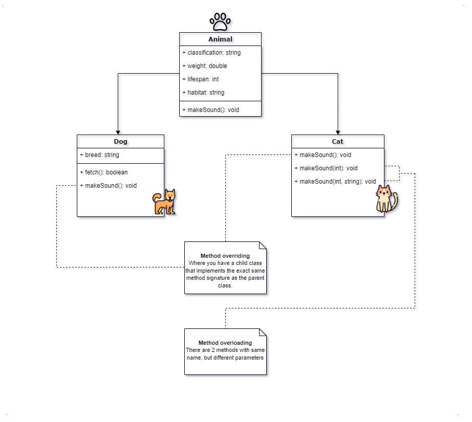

# The 6 Fundamental concepts of OOP
- Objects
- Classes
- Abstraction
- Encapsulation
- Inheritance
- Polymorphism

## Objects
A *representation of a real-world entity*, it's like a general term for a thing.

e.g: _Person, Book, Place, Animal, Product etc._ 

_Anything that you want to store & process data about._

## Classes

To create an object, you need a Class. A class is a blueprint or template that defines the attributes & operations/behavior of an object. Put it simply, a class is a template for creating objects.

Inside a class, there are attributes and operations:

#### Attributes
Attributes describes the object, they sometimes refer to as fields. Because they contain data. Most developers know them as properties. 

*Example:*

We have a class of a Person, and we know that a person has firstname, middlename, and lastname, gender, date of birth and occupation, etc. These informations are called *attributes/fields/properties* of the Person class.
<br />

#### Operations

Operations are actions that can be done to or perform to an object. They sometimes referred to as behaviors, but more commonly methods.

*Example:*

Let's say we have a class of a Person, and we know that a person has information like firstname, lastname, occupation, etc. We want to save the person's information, and we can update it too.

There's also occupation in the attributes, so this person could be an employee. If it's an employee, we can pay the person wage and give a promotion.

With that said, we now have an idea of what operation to put in this class. We will translate these operations from common language to code. See table below:

| Common Language | Code (Methods) |
| --- | --- |
| Save the person's information | ```saveInfo()``` |
| Update the person's information | ```updateInfo()``` |
| Pay the person wage | ```payWage()``` |
| Give a promotion | ```setPromotion()``` |

## Abstraction

Abstraction is the process of simplifying complex systems by breaking them down into smaller, more manageable parts. 

## Encapsulation

Encapsulation is basically hiding data and complexity. It is a principle of hiding internal implementation details of an object and exposing only necessary code to interact with it. Also, it helps to protect the objects data from unauthorized access and modification of code.

A good example in real-world is when you are coding, there are already built-in class libraries created by experienced programmers already made available for you to use.

Like a *Speech Recognition library*.

All you have to do is just import the library and use the methods available. It's not necessary to understand the inner workings of the class, all you need to know is the name of the class, the properties and methods available, and any data that need to be supplied when they are called.

This simplifies the use of objects and helps to ensure that the data and objects are encapsulated within the class library are safe.

## Inheritance

A class can derive its methods & properties from another class.

Inheritance promotes **code reusability** and the creation of a **hierarchical relationship between classes**, where a subclass can extend the functionality of its superclass.

_The image below illustrates the concept of Encapsulation:_


*Explanation:*

1)  The ```Person class``` defines the methods and properties of a person.
<br />

2) The ```Employee class``` derives the methods and properties of Person class, and can have some methods and properties on its own. Because an Employee is a type of person.
<br />

3) The ```Customer class``` derives the methods and properties of Person class, and can have some methods and properties on its own. Because a Customer is also a type of person.
<br />

4) ```Programmer class```, ```Manager class``` and ```Cleaner class``` derives the methods and properties of the Employee class. Each of these classes can have their own properties and methods specific to them. Because a programmer, manager and cleaner are also a type of Employee and an Employee is also a type of Person. This will then result to a hierarchical relationship between classes.
<br />

*Definition of Terms:*

The class at the start of the inheritance is called the **BASE CLASS** (*Person*).

Any class that derives from another class, is called a **SUBCLASS** (*Employee & Customer; under Employee: Manager, Programmer, Cleaner*)

Any Class that is derived from, is called a **SUPERCLASS** (*Person & Employee*).

## Polymorphism

Polymorphism basically means ```many forms```. 'Poly' means *'many'* and 'morphism' means *'form/shape'*. Different subclasses that belong to same superclass, can implement their shared interface in different ways.

A good example of this is the category of Animal. Let's say we have a cat and a dog. All animals can make a sound. But every animal sounds different.

To implement, we will have a superclass of ```Animal``` and under it, are 2 subclasses ```Dog``` and ```Cat```.



Animal class will have a method called ```makeSound()``` that prints _'Rawr rawr ~~'_.

Cat and Dog classes inherits Animal class, so that means they can access the makeSound() method.

If Cat or Dog class doesn't implement a makeSound() method on their own, by default it will call the makeSound() method from Animal class (parent class).

But if Cat/Dog class or both implements their own makeSound() method, say for example Cat class will have a makeSound() method that prints <span style="color: green;">'Meow meow ~~'</span>.

And Dog class implements makeSound() method that prints <span style="color: green;">'Woof woof ~~'</span>. That's when **Polymorphism** comes into play. Basically, creating their own version of makeSound() method, hence many forms.

This is also called **'Method overriding'**, when you create a method inside the child class with the exact same method signature as the parent class.

And **'Method overloading'**, is when you have 2 or more methods in the class that have exactly the same method name but takes different parameters.